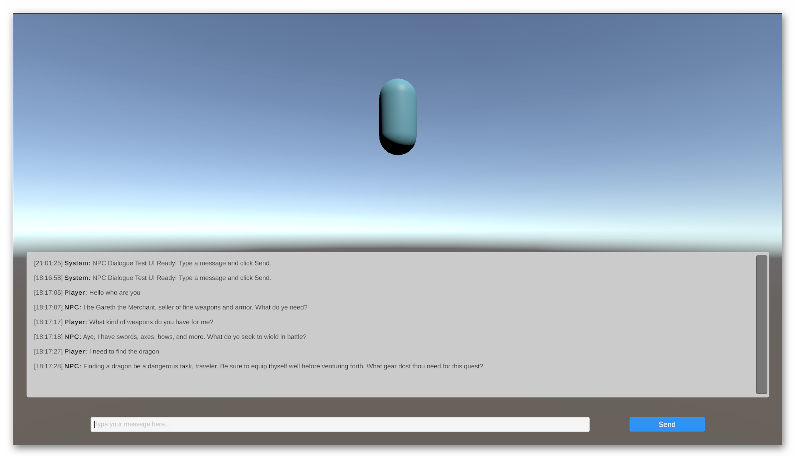

# AI NPC Debug Toolkit

Debugging and visualization tools for AI-powered NPC dialogue systems in Unity. Works with ChatGPT, Claude, Gemini, and custom LLM providers. Includes real-time debugging, character consistency validation, and performance monitoring.


[](https://docs.unity3d.com/Manual/upm-ui.html)




## Quick Install

**Via Unity Package Manager:**

1. Open Unity Package Manager (`Window → Package Manager`)
2. Click **+** → **Add package from git URL**
3. Paste:
```
https://github.com/angrysharkstudio/unity-ai-npc-debugging.git?path=Assets/com.angryshark.aidebugger
```

**Lock to Specific Version (Recommended for Production):**
```
https://github.com/angrysharkstudio/unity-ai-npc-debugging.git?path=Assets/com.angryshark.aidebugger#v1.0.0
```

The package installs in seconds with dependencies handled automatically.

---

## Features

### Real-Time Debugging
- **Visual Response Inspector**: See AI responses in-scene with customizable debug UI
- **Live API Monitoring**: Track request/response times, token usage, and API call status
- **Error Detection**: Catch and visualize API errors before they affect gameplay
- **Performance Metrics**: Monitor response times, cache hit rates, and memory usage

### Character Consistency
- **Profile Validation**: Ensure NPCs stay in character across conversations
- **Personality Tracking**: Detect when AI responses deviate from defined personality
- **Context Awareness**: Verify NPCs maintain conversation context and memory
- **Consistency Scoring**: Quantifiable character adherence metrics

### Content Filtering
- **Policy Enforcement**: Validate responses against content policies
- **Custom Rule System**: Define acceptable response patterns and restrictions
- **Automatic Flagging**: Highlight problematic content before player exposure
- **Filter Presets**: Pre-configured filters for common use cases

### Performance Optimization
- **Response Caching**: Conversation caching reduces API calls
- **Memory Management**: Efficient conversation history handling
- **Batch Processing**: Optimize multiple NPC interactions
- **Token Optimization**: Minimize API costs while maintaining quality

### Production Features
- **No-Code Setup**: ScriptableObject-based character profiles
- **Multiple LLM Support**: ChatGPT, Claude, Gemini, and custom endpoints
- **Async/Await Pattern**: Non-blocking API calls maintain smooth gameplay
- **Error Handling**: Graceful degradation with fallback responses
- **Inspector Integration**: Custom inspectors for easy configuration

---

## What This Package Provides

| Without This Package                    | With This Package                          |
|-----------------------------------------|--------------------------------------------|
| Manual file copying, outdated versions  | One-click installation via Package Manager |
| No visibility into AI responses         | Real-time visual debugging                 |
| Character inconsistencies hard to catch | Automatic consistency validation           |
| High API costs from redundant calls     | Built-in caching and optimization          |
| Custom debugging code per project       | Reusable tools included                    |
| Hours of integration work               | Minutes to first working NPC               |

---

## Installation

### Method 1: Unity Package Manager (Recommended)

1. Open your Unity project
2. Navigate to `Window → Package Manager`
3. Click the **+** dropdown in the top-left corner
4. Select **"Add package from git URL..."**
5. Enter the package URL:

**Latest Version:**
```
https://github.com/angrysharkstudio/unity-ai-npc-debugging.git?path=Assets/com.angryshark.aidebugger
```

**Specific Version (Recommended):**
```
https://github.com/angrysharkstudio/unity-ai-npc-debugging.git?path=Assets/com.angryshark.aidebugger#v1.0.0
```

6. Click **Add**
7. Unity downloads and installs the package automatically

### Method 2: Via manifest.json

For automated setups or CI/CD pipelines:

1. Open `Packages/manifest.json` in your project
2. Add to the `dependencies` section:

```json
{
  "dependencies": {
    "com.angryshark.aidebugger": "https://github.com/angrysharkstudio/unity-ai-npc-debugging.git?path=Assets/com.angryshark.aidebugger#v1.0.0",
    "com.unity.textmeshpro": "3.0.6"
  }
}
```

3. Save the file
4. Unity automatically installs the package when it detects the change

### Verifying Installation

After installation:
- Package appears in Package Manager under **"Packages - Custom"**
- Package name: **"AI NPC Debug Toolkit"**
- Namespace `AngrySharkStudio.LLM` is available
- Create menu shows **"Create → AI NPC → Character Profile"**

---

## Quick Start

### Step 1: Import the Sample

1. Open Package Manager (`Window → Package Manager`)
2. Find **"AI NPC Debug Toolkit"** in the packages list
3. Expand the **"Samples"** section
4. Click **"Import"** next to **"Basic Console Example"**
5. Sample imports to `Assets/Samples/AI NPC Debug Toolkit/1.0.0/Basic Console Example/`

### Step 2: Configure API Key

1. Locate `api-config.example.json` in the imported sample
2. Duplicate and rename to `api-config.json`
3. Add your API credentials:

```json
{
  "provider": "openai",
  "apiKey": "sk-your-api-key-here",
  "model": "gpt-4",
  "maxTokens": 150,
  "temperature": 0.7
}
```

**Supported Providers:**
- `"openai"` - ChatGPT (GPT-3.5, GPT-4)
- `"anthropic"` - Claude (Claude 3, Claude 3.5)
- `"google"` - Gemini (Gemini Pro)
- `"custom"` - Your own endpoint

### Step 3: Create Your First NPC

**Option A: Use the Sample Scene**
1. Open the sample scene from the imported folder
2. Press Play
3. Interact with the example NPC in the console
4. Observe real-time debugging in action

**Option B: Create From Scratch**

1. **Create a Character Profile**
    - Right-click in Project window
    - Select **Create → AI NPC → Character Profile**
    - Configure personality, background, and behavior

2. **Add to Your GameObject**
   ```csharp
   using AngrySharkStudio.LLM;
   using UnityEngine;

   public class MyNpc : MonoBehaviour
   {
       [SerializeField] private CharacterProfile characterProfile;
       [SerializeField] private AiResponseDebugger debugger;

       private LlmManager llmManager;

       void Start()
       {
           llmManager = new LlmManager(characterProfile);
           debugger.Initialize(characterProfile.characterName);
       }

       public async void SayHello()
       {
           string response = await llmManager.SendMessageAsync("Hello!");
           debugger.ShowResponse(response);
           Debug.Log($"NPC: {response}");
       }
   }
   ```

3. **Add Debug Visualizer**
    - Add `AiResponseDebugger` component to your NPC GameObject
    - Assign your Character Profile
    - Configure visualization settings in Inspector

4. **Test It**
    - Press Play
    - Call `SayHello()` via Inspector button or script
    - Watch real-time debugging UI display the AI response

You now have a working AI NPC with debugging tools.

---

## Core Components

### AiResponseDebugger

Real-time visualization of AI responses with customizable UI.

**Features:**
- In-scene response display
- Response time tracking
- Token usage monitoring
- Error visualization
- Customizable colors and positioning

**Usage:**
```csharp
using AngrySharkStudio.LLM;

[SerializeField] private AiResponseDebugger debugger;

void Start()
{
    debugger.Initialize("Merchant NPC");
    debugger.SetPosition(new Vector3(0, 2, 0));
}

public void ShowAiResponse(string response)
{
    debugger.ShowResponse(response);
    debugger.UpdateMetrics(responseTime: 1.2f, tokenCount: 45);
}
```

**Inspector Settings:**
- **Display Duration**: How long responses stay visible
- **Text Color**: Response text color
- **Background Color**: Debug panel background
- **Font Size**: Display text size
- **World Space**: Follow GameObject or screen space

### AiContentFilter

Validates AI responses against content policies and character rules.

**Features:**
- Policy enforcement
- Custom validation rules
- Keyword filtering
- Pattern matching
- Severity levels

**Usage:**
```csharp
using AngrySharkStudio.LLM;

[SerializeField] private AiContentFilter contentFilter;

async void ProcessResponse(string response)
{
    FilterResult result = contentFilter.ValidateContent(response);

    if (result.IsValid)
    {
        // Response passed all filters
        DisplayToPlayer(response);
    }
    else
    {
        Debug.LogWarning($"Content filtered: {result.Reason}");
        // Use fallback or request new response
    }
}
```

**Configuration:**
- **Filter Presets**: Family-friendly, Teen, Mature
- **Custom Keywords**: Block specific words or phrases
- **Regex Patterns**: Advanced content matching
- **Character Consistency**: Validate against profile

### AiResponseCache

Conversation caching to reduce API calls and costs.

**Features:**
- Automatic response caching
- Conversation history management
- Cache hit rate tracking
- Memory-efficient storage
- Configurable cache size

**Usage:**
```csharp
using AngrySharkStudio.LLM;

[SerializeField] private AiResponseCache responseCache;

async Task<string> GetResponse(string message)
{
    // Check cache first
    if (responseCache.TryGetCachedResponse(message, out string cached))
    {
        Debug.Log("Cache hit - no API call needed");
        return cached;
    }

    // Make API call if not cached
    string response = await llmManager.SendMessageAsync(message);

    // Cache for future use
    responseCache.CacheResponse(message, response);

    return response;
}
```

**Settings:**
- **Max Cache Size**: Maximum cached conversations
- **Cache Duration**: How long to keep responses
- **Hit Rate Display**: Monitor cache effectiveness
- **Auto Cleanup**: Automatic memory management

### LlmManager

Core manager for LLM communication with multiple provider support.

**Features:**
- Multi-provider support (OpenAI, Anthropic, Google)
- Async/await pattern
- Error handling and retries
- Token optimization
- Context management

**Usage:**
```csharp
using AngrySharkStudio.LLM.Core;
using System.Threading.Tasks;

private LlmManager llmManager;

void Start()
{
    llmManager = new LlmManager(characterProfile);
    llmManager.OnError += HandleLlmError;
}

async Task TalkToNpc(string playerMessage)
{
    try
    {
        string response = await llmManager.SendMessageAsync(playerMessage);
        Debug.Log($"NPC Response: {response}");
    }
    catch (System.Exception e)
    {
        Debug.LogError($"LLM Error: {e.Message}");
    }
}

void HandleLlmError(string error)
{
    Debug.LogWarning($"LLM Manager Error: {error}");
    // Implement fallback logic
}
```

**Configuration:**
- **Provider Selection**: OpenAI, Anthropic, Google, Custom
- **Model Selection**: GPT-4, Claude 3, Gemini Pro
- **Max Tokens**: Control response length
- **Temperature**: Creativity vs consistency (0.0 - 1.0)
- **Timeout**: Request timeout in seconds

### CharacterProfile (ScriptableObject)

No-code character configuration using Unity's ScriptableObject system.

**Features:**
- Visual Inspector editing
- Reusable profiles
- Version control friendly
- Runtime modification support
- Preset library

**Creating Profiles:**

1. **Via Project Window:**
    - Right-click in Project window
    - **Create → AI NPC → Character Profile**
    - Configure in Inspector

2. **Via Tools Menu:**
    - **Tools → AngrySharkStudio → AI NPC → Character Profiles**
    - Opens profile manager window
    - Create and organize multiple profiles

**Profile Fields:**

```csharp
[CreateAssetMenu(fileName = "CharacterProfile", menuName = "AI NPC/Character Profile")]
public class CharacterProfile : ScriptableObject
{
    [Header("Basic Information")]
    public string characterName = "Merchant";
    public string characterRole = "Shopkeeper in a fantasy village";

    [Header("Personality")]
    [TextArea(3, 6)]
    public string personalityDescription = "Friendly, slightly greedy, loves to haggle";

    [Header("Background")]
    [TextArea(4, 8)]
    public string backstory = "Has run this shop for 20 years...";

    [Header("Behavior Rules")]
    public List<string> conversationRules = new List<string>
    {
        "Always address customer as 'friend'",
        "Offer deals but never go below 80% of asking price",
        "Mention rare items occasionally"
    };

    [Header("Content Restrictions")]
    public List<string> forbiddenTopics = new List<string>
    {
        "Politics", "Religion", "Explicit content"
    };
}
```

**Usage in Code:**

```csharp
[SerializeField] private CharacterProfile profile;

void Start()
{
    Debug.Log($"Talking to {profile.characterName}");
    Debug.Log($"Role: {profile.characterRole}");

    // Initialize LLM with profile
    llmManager = new LlmManager(profile);
}
```

**Profile Library:**

Create a library of reusable profiles:
- `Profiles/MerchantNPC.asset`
- `Profiles/QuestGiverNPC.asset`
- `Profiles/CompanionNPC.asset`
- `Profiles/VillainNPC.asset`

Drag and drop onto different NPCs to quickly configure personalities.

---

## Requirements

### Unity Version
- **Minimum**: Unity 2020.3 LTS
- **Recommended**: Unity 2021.3 LTS or newer
- **Tested**: Unity 2020.3, 2021.3, 2022.3, 2023.1

### Dependencies
- **TextMeshPro**: Usually included by default with Unity
- **Newtonsoft Json**: Optional, for advanced JSON handling
- **Unity UI**: Required for debug visualizations

### Platform Support
- Windows, macOS, Linux (Editor and Standalone)
- iOS, Android (requires network access)
- WebGL (with CORS considerations)
- Console platforms (Xbox, PlayStation, Switch with network)

### API Requirements
- Active internet connection for LLM API calls
- Valid API key from one of the supported providers:
    - **OpenAI**: [platform.openai.com/api-keys](https://platform.openai.com/api-keys)
    - **Anthropic**: [console.anthropic.com](https://console.anthropic.com)
    - **Google**: [ai.google.dev](https://ai.google.dev)

---

## Updating the Package

### Check for Updates

1. Open Package Manager
2. Select **"AI NPC Debug Toolkit"**
3. Check for **"Update to X.X.X"** button

### Update to Latest Version

**Method 1: Via Package Manager**
1. Click **"Update"** button in Package Manager
2. Unity downloads and installs the latest version

**Method 2: Change manifest.json**

Update the version tag in `Packages/manifest.json`:

```json
{
  "dependencies": {
    "com.angryshark.aidebugger": "https://github.com/angrysharkstudio/unity-ai-npc-debugging.git?path=Assets/com.angryshark.aidebugger#v1.1.0"
  }
}
```

### Version Locking

For production projects, lock to a specific version:

```
#v1.0.0  ← Lock to exact version
#develop ← Use development branch (not recommended for production)
```

**Semantic Versioning:**
- **v1.0.0 → v1.0.1**: Bug fixes (safe to update)
- **v1.0.0 → v1.1.0**: New features (backward compatible)
- **v1.0.0 → v2.0.0**: Breaking changes (review changelog before updating)

---

## Sample Projects

The package includes importable samples demonstrating all features.

### Importing Samples

1. Open Package Manager (`Window → Package Manager`)
2. Select **"AI NPC Debug Toolkit"**
3. Scroll down to **"Samples"** section
4. Click **"Import"** next to desired sample

### Basic Console Example

**Location**: `Assets/Samples/AI NPC Debug Toolkit/1.0.0/Basic Console Example/`

**Contents:**
- `SimpleConsoleTest.cs` - Minimal console-based AI interaction
- `SmartNpcExample.cs` - Complete NPC implementation
- `ExampleScene.unity` - Preconfigured test scene
- `api-config.example.json` - API configuration template

**What It Demonstrates:**
- Basic LlmManager usage
- Character profile integration
- Debug visualization setup
- Error handling patterns
- Response caching

**How to Use:**
1. Import the sample
2. Configure `api-config.json` with your API key
3. Open `ExampleScene.unity`
4. Press Play
5. Type messages in the Console window
6. Observe AI responses and debug UI

---

## API Configuration

### Configuration File: api-config.json

Place in your project root or `Resources/` folder:

```json
{
  "provider": "openai",
  "apiKey": "your-api-key-here",
  "model": "gpt-4",
  "maxTokens": 150,
  "temperature": 0.7,
  "timeout": 30
}
```

### Provider-Specific Settings

#### OpenAI (ChatGPT)
```json
{
  "provider": "openai",
  "apiKey": "sk-...",
  "model": "gpt-4",
  "maxTokens": 150,
  "temperature": 0.7,
  "topP": 1.0,
  "frequencyPenalty": 0.0,
  "presencePenalty": 0.0
}
```

**Available Models:**
- `gpt-4` - Most capable, higher cost
- `gpt-4-turbo` - Fast GPT-4 variant
- `gpt-3.5-turbo` - Cost-effective, good quality

#### Anthropic (Claude)
```json
{
  "provider": "anthropic",
  "apiKey": "sk-ant-...",
  "model": "claude-3-opus-20240229",
  "maxTokens": 150,
  "temperature": 0.7
}
```

**Available Models:**
- `claude-3-opus-20240229` - Most capable
- `claude-3-sonnet-20240229` - Balanced
- `claude-3-haiku-20240307` - Fast and affordable

#### Google (Gemini)
```json
{
  "provider": "google",
  "apiKey": "AIza...",
  "model": "gemini-pro",
  "maxTokens": 150,
  "temperature": 0.7
}
```

**Available Models:**
- `gemini-pro` - Multimodal capable
- `gemini-pro-vision` - Image understanding

#### Custom Endpoint
```json
{
  "provider": "custom",
  "apiKey": "your-key",
  "endpoint": "https://your-api.com/v1/chat",
  "model": "your-model",
  "maxTokens": 150,
  "temperature": 0.7
}
```

### Security Best Practices

**Never commit API keys to version control.**

**Option 1: Environment Variables**
```csharp
string apiKey = System.Environment.GetEnvironmentVariable("OPENAI_API_KEY");
```

**Option 2: .gitignore**
Add to `.gitignore`:
```
api-config.json
**/api-config.json
```

**Option 3: Unity PlayerPrefs** (Editor Only)
```csharp
#if UNITY_EDITOR
string apiKey = UnityEditor.EditorPrefs.GetString("LLM_API_KEY");
#endif
```

---

## Troubleshooting

### Package Installation Issues

#### "Unable to add package" Error

**Cause**: Git not installed or repository access issue

**Solutions:**
1. Install Git from [git-scm.com](https://git-scm.com)
2. Verify Git is in system PATH
3. Check repository is public or you have access
4. Try HTTPS URL instead of SSH

#### Package Not Appearing in Package Manager

**Cause**: Invalid package.json or wrong URL format

**Solutions:**
1. Verify URL includes `?path=Assets/com.angryshark.aidebugger`
2. Check Unity version meets minimum requirement (2020.3+)
3. Restart Unity Editor
4. Clear Package Manager cache: `Edit → Preferences → Clear Cache`

### Compilation Errors

#### "Type or namespace 'AngrySharkStudio' could not be found"

**Cause**: Package not installed or assembly definitions missing

**Solutions:**
1. Verify package shows in Package Manager
2. Check `com.angryshark.aidebugger` folder exists in `Packages/`
3. Reimport package: Remove → Add again
4. Restart Unity Editor

#### "Assembly reference errors"

**Cause**: Assembly definition configuration issue

**Solutions:**
1. Check your project's .asmdef references the package runtime assembly
2. Add assembly reference in Inspector:
    - Select your .asmdef file
    - Add `AngryShark.AiDebugger.Runtime` to References
3. Reimport scripts: `Assets → Reimport All`

### Runtime Issues

#### "API Key Invalid" or "Unauthorized" Errors

**Cause**: Incorrect or missing API key

**Solutions:**
1. Verify `api-config.json` exists in correct location
2. Check API key is valid on provider's website
3. Ensure no extra spaces or line breaks in key
4. Test API key using provider's web interface
5. Check account has active billing/credits

#### No AI Response or Timeout

**Cause**: Network issues or API unavailable

**Solutions:**
1. Check internet connection
2. Verify firewall allows Unity to make HTTP requests
3. Increase timeout in `api-config.json`: `"timeout": 60`
4. Check provider's status page for outages
5. Try different model (e.g., `gpt-3.5-turbo` instead of `gpt-4`)

#### Debug UI Not Displaying

**Cause**: Missing dependencies or component configuration

**Solutions:**
1. Verify TextMeshPro is installed: `Window → TextMeshPro → Import TMP Essentials`
2. Check `AiResponseDebugger` component is active
3. Verify Canvas exists in scene (debug UI requires Canvas)
4. Check camera has `Physics Raycaster` or `Graphic Raycaster`
5. Ensure debug UI layer is visible to camera

### Character Profile Issues

#### "Create → AI NPC → Character Profile" Menu Missing

**Cause**: Package not properly imported or namespace conflict

**Solutions:**
1. Reimport package completely
2. Check Console for import errors
3. Verify `CharacterProfile.cs` exists in package
4. Restart Unity Editor
5. Use `Tools → AngrySharkStudio → AI NPC → Character Profiles` instead

#### Character Not Staying Consistent

**Cause**: Profile configuration or LLM temperature too high

**Solutions:**
1. Lower temperature in `api-config.json`: `"temperature": 0.3`
2. Add more specific rules to Character Profile
3. Use `AiContentFilter` to enforce consistency
4. Provide more detailed backstory and personality
5. Use GPT-4 or Claude for better consistency (vs GPT-3.5)

### Performance Issues

#### Slow Response Times

**Cause**: API latency or large conversation history

**Solutions:**
1. Enable `AiResponseCache` to reduce API calls
2. Reduce `maxTokens` in config: `"maxTokens": 100`
3. Use faster models: `gpt-3.5-turbo`, `claude-3-haiku`
4. Implement conversation history trimming
5. Use async/await properly (don't block main thread)

#### High Memory Usage

**Cause**: Large conversation cache or memory leaks

**Solutions:**
1. Configure `AiResponseCache` max size: `cache.SetMaxSize(100)`
2. Clear cache periodically: `cache.Clear()`
3. Limit conversation history length
4. Dispose LlmManager properly in OnDestroy
5. Use object pooling for debug UI elements

---


## License

MIT License

Copyright (c) 2025 Angry Shark Studio

Permission is hereby granted, free of charge, to any person obtaining a copy
of this software and associated documentation files (the "Software"), to deal
in the Software without restriction, including without limitation the rights
to use, copy, modify, merge, publish, distribute, sublicense, and/or sell
copies of the Software, and to permit persons to whom the Software is
furnished to do so, subject to the following conditions:

The above copyright notice and this permission notice shall be included in all
copies or substantial portions of the Software.

THE SOFTWARE IS PROVIDED "AS IS", WITHOUT WARRANTY OF ANY KIND, EXPRESS OR
IMPLIED, INCLUDING BUT NOT LIMITED TO THE WARRANTIES OF MERCHANTABILITY,
FITNESS FOR A PARTICULAR PURPOSE AND NONINFRINGEMENT. IN NO EVENT SHALL THE
AUTHORS OR COPYRIGHT HOLDERS BE LIABLE FOR ANY CLAIM, DAMAGES OR OTHER
LIABILITY, WHETHER IN AN ACTION OF CONTRACT, TORT OR OTHERWISE, ARISING FROM,
OUT OF OR IN CONNECTION WITH THE SOFTWARE OR THE USE OR OTHER DEALINGS IN THE
SOFTWARE.

---

## Support

- **Issues**: [GitHub Issues](https://github.com/angrysharkstudio/unity-ai-npc-debugging/issues)
- **Email**: studio.angry.shark@gmail.com
- **Website**: [https://www.angry-shark-studio.com](https://www.angry-shark-studio.com)
- **Blog**: [Unity Package Creation Guide](https://www.angry-shark-studio.com/blog/create-unity-package-github-package-manager)

---

## Version History

See [CHANGELOG.md](CHANGELOG.md) for detailed version history.

**Current Version**: 1.0.0
**Released**: October 2025
**Unity Compatibility**: 2020.3+

---

**Made by Angry Shark Studio**
[Website](https://www.angry-shark-studio.com) • [GitHub](https://github.com/angrysharkstudio) • [Blog](https://www.angry-shark-studio.com/blog)
